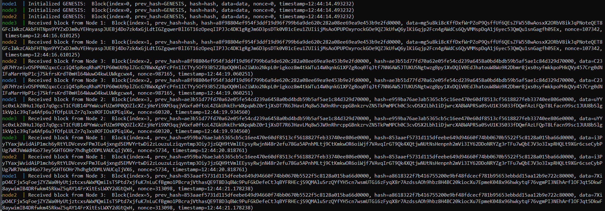

# PythonBlockchain

## Описание
Примитивный Blockchain на Python с использованием веб-серверов, созданных при помощи фреймворка Flask. 

Всего в проекте присутствует три основные сущности:
- **block** - класс для генерации блоков цепочки блокчейна, состоящих из следующих полей:
    - **index** - номер блока по возрастанию, начиная с 0 у `GENESIS`.
    - **hash** - хеш текущего блока, который вычисляется путем конкатенации всех других полей и пересчитывается путем изменения `nonce` до тех пор, пока не будет заканчиваться на `0000`
    - **prev_hash** - хеш предыдущего блока.
    - **data** - некоторые данные, которые являются случайной строчкой из 256 символов.
    - **nonce** - это дополнение, за счет изменения которого можно пересчитывать `hash`.
    - **timestamp** - временная метка
- **node** - класс текущей node/сервера, который хранит в себе информацию о цепочке блокчейна на данном сервере и содержит функцию для обработки нового блока. В случае добавления при помощи еще одной функции этот блок будет распечатан. 
- **network test** - класс, за счет которого реализуется взаимодействие между веб-серверами путем отправления друг другу новых блоков, сгенерированных относительно своего последнего блока. Генерация происходит бесконечно после получения блока `GENESIS`.

## Тестирование

master [](https://github.com/igalaxy00/A.Block/actions/workflows/python-app.yml)

dev [](https://github.com/igalaxy00/A.Block/actions/workflows/python-app.yml)

## Запуск проекта
Для запуска проекта требуется произвести следующие действия:

1)  Клонируем проект к себе на устройство при помощи команды 

```git clone https://github.com/igalaxy00/A.Block.git```

2) Перейти в папку проекта

```
docker-compose build
docker-compose up   
```
## Демонстрация работы

Демонстрация работы  ```docker-compose```:



## Тестирование

Реализованы следующие виды тестов.

*Модульные тесты:* 
* Конвертация блок в JSON-формат и обратно
* Генерация genesis блока
* Генерация данных
* Получение хэша по атрибутам блока
* Генерация правильного хэша
* Генерация цепочки блоков и её валидность

*Интеграционные тесты:*
* Получение блока/блоков от соседних узлов и обработка полученного блока
* Отправка сгенерированного блока соседним узлам
* Проверка работы трех узлов
Реализован тестовый пайплайн Github Actions с запуском тестов на разных ОС: Linux, Windows, MacOS.